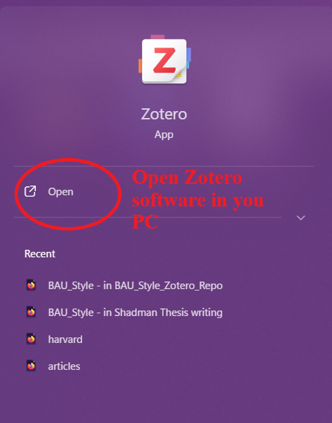
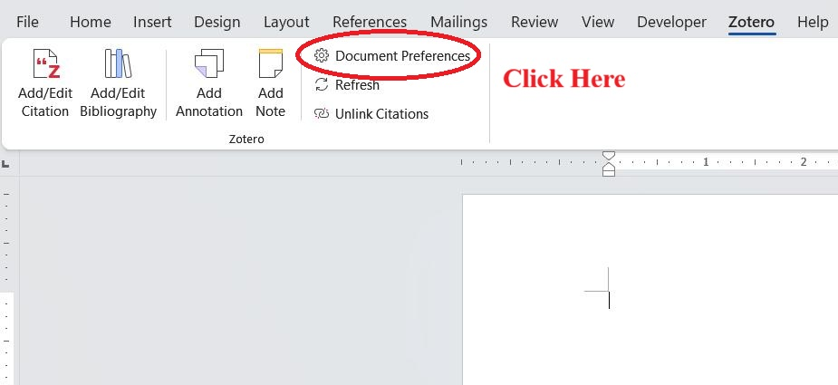
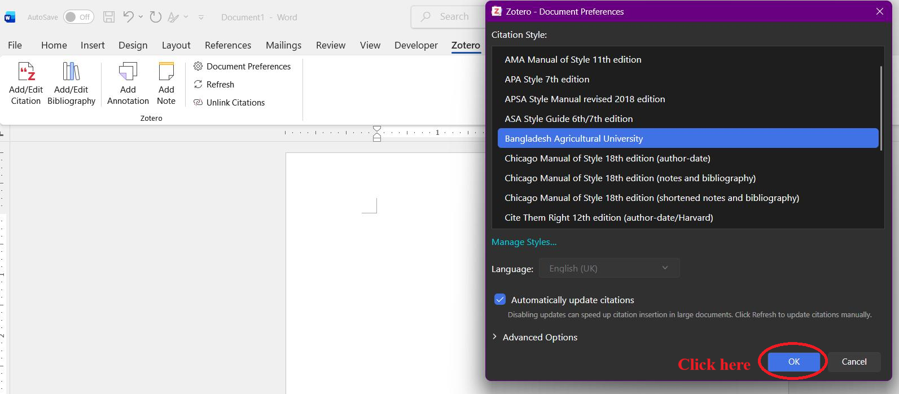

# BAU Style for Zotero

This is the official customized Zotero citation style for **[Bangladesh Agricultural University (BAU)](https://bau.edu.bd/)**.

## Installation

1. Go to the [Releases](https://github.com/rash-Rifat/BAU_Style_Zotero/releases/latest) page.
2. Download the `BAU_Style.csl` file.
3. Open Zotero.
4. Go to **Edit > Settings** (Windows/Linux) or **Zotero > Settings** (Mac).
5. Navigate to the **Cite** tab, and then the **Styles** sub-tab.
6. Click the **+** button.
7. Select the downloaded `BAU_Style.csl` file to install it.

## Usage in Microsoft Word

Once installed in Zotero, you can use the style directly in your Microsoft Word documents.

1. **Open Zotero** in the background on your PC.
    

2. In Microsoft Word, click the **Zotero** tab, then click **Document Preferences**.
    

3. Select **Bangladesh Agricultural University** from the list of Citation Styles and click **OK**.
    

*Note: For 1.5 line spacing in your bibliography, simply highlight the bibliography in Word and set the line spacing to 1.5 in the Home tab.*

## Contributing

If you find any issues or would like to propose improvements to this style, please feel free to [open an issue](https://github.com/rash-Rifat/BAU_Style_Zotero/issues) or submit a Pull Request!

## Maintainer
- **M. Rashidul Alam Rifat** (chem.rashidul.alam@gmail.com)
